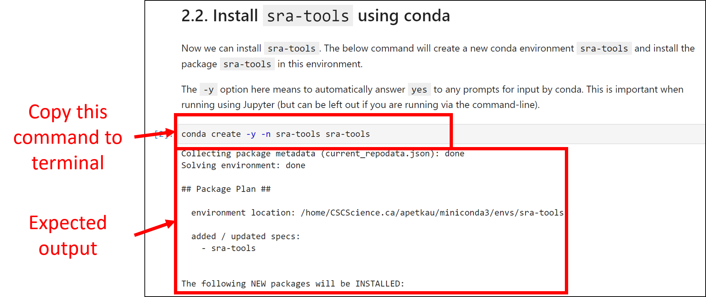

# Downloading and assembling microbial sequence data
[![Binder][]][tutorial-binder]

This repository contains the slides and additional materials for the **Downloading and assembling microbial sequence data** [MMID Coding workshop][] for **January 26, 2022**.

## 1. Workshop material

* [MMID_CodingWorkshop-2022-01-26-AssemblingMicrobialSequence.pdf](MMID_CodingWorkshop-2022-01-26-AssemblingMicrobialSequence.pdf): The slides for the workshop.
* [microbial-genome-assembly.ipynb](tutorial/microbial-genome-assembly.ipynb): The Jupyter notebook containing the commands used to download and assemble a genome.

## 2. Workshop tutorial

In addition to the slides, there is also an additional tutorial provided as an interactive [Jupyter notebook][Jupyter].

* [microbial-genome-assembly.ipynb](tutorial/microbial-genome-assembly.ipynb)

### 2.1. Run commands in local terminal

The easiest way to use the Juptyer notebook above is to open it up in GitHub ([microbial-genome-assembly.ipynb][genome-assembly.ipynb]) and then copy/paste the appropriate commands shown into a local terminal/Bash.



### 2.2. Run in a cloud-based environmend

If you instead wish to launch the Juptyer notebook in a cloud-based environment to follow along please click the [![Binder][]][tutorial-binder] link.

### 2.3. Run on a local environment

To run the Jupyter notebook in a local termainl first please make sure you have [conda/bioconda](https://bioconda.github.io/user/install.html) installed. Then you can install Juptyer (and the software necessary to run Bash in Jupyter) with:

```bash
conda create -c conda-forge -c bioconda -c defaults -n jupyterlab jupyterlab calysto_bash zip mamba
```

Now, to run this tutorial using Juptyer please do:

```bash
conda activate jupyterlab

# Only need to run this once to download workshop materials
git clone https://github.com/MMID-coding-workshop/2022-01-26-Downloading-and-assembling-microbial-sequence-data.git

jupyter lab
```

The command should show you how to open up the running Jupyter application in your web browser. Navigate to and open the file `tutorial/microbial-genome-assembly.ipynb` and you should now be able to run through it on your local machine.

## 3. Software used

A list of the necessary software used for this tutorial is given below:

* [conda/bioconda](https://bioconda.github.io/user/install.html): Software to install and manage software packages.
* [sra-tools](https://github.com/ncbi/sra-tools): `conda create -y -n sra-tools sra-tools`
    * `prefetch`: Downloads genomes from NCBI.
    * `fasterq-dump`: Converts genomes to fastq format
    * `srapath`: Prints paths to download SRA files.
* **gzip**: Should come installed on any standard Linux/Unix computer (though you can install with `conda install gzip`)
* [fastp](https://github.com/OpenGene/fastp): Quality reports and filtering of sequence reads. `conda create -y -n fastp fastp`
* [skesa](https://github.com/ncbi/SKESA): De novo assembly of bacterial genomes sequenced using Illumina. `conda create -y -n skesa skesa`
* [Quast](http://cab.cc.spbu.ru/quast/): Quality assessment of genome assemblies. `conda create -y -n quast quast`.

Some other software may be demonstrated in the tutorial but it's not neccessary for performing a genome assembly.

[Jupyter]: https://jupyter.org/
[Binder]: https://mybinder.org/badge_logo.svg
[tutorial-binder]: https://mybinder.org/v2/gh/MMID-coding-workshop/2022-01-26-Downloading-and-assembling-microbial-sequence-data/main?urlpath=lab%2Ftree%2Ftutorial%2Fmicrobial-genome-assembly.ipynb
[MMID Coding workshop]: https://umanitobammidsc.ca/mmid-coding-workshop/
[genome-assembly.ipynb]: tutorial/microbial-genome-assembly.ipynb
